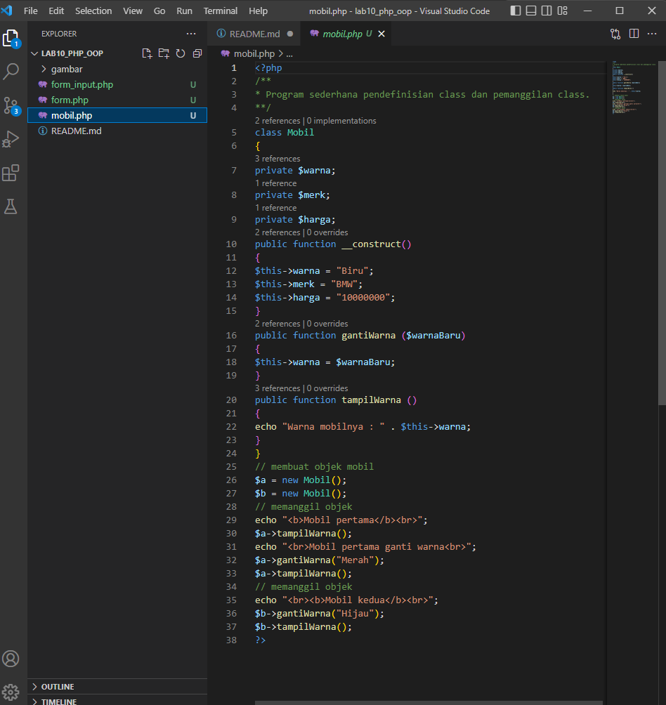
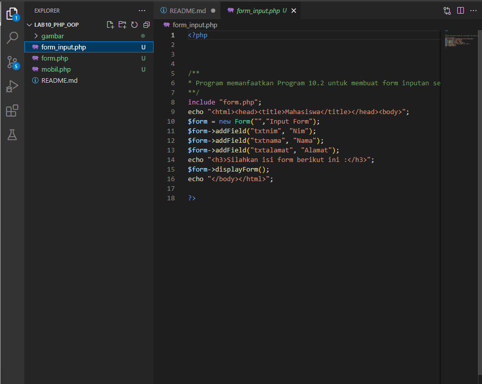

# lab10_php_oop
# Lab10Web
## PHP OOP 
### Apa Itu OOP ?

•OOP (Object Oriented Programming) adalah suatu metode
pemrograman yang berorientasi kepada objek.

•Tujuan dari OOP diciptakan adalah untuk mempermudah
pengembangan program dengan cara mengikuti model yang
telah ada di kehidupan sehari-hari.

### Langkah-Langkah Praktikum
### mobile.php

Buat file baru dengan nama mobile.php

Dan masukan lah syntax sebagai berikut :

Dan ini hasilnya :
)
### form.php

Buatlah file baru dengan nama form.php

Dan masukan lah kode berikut :

Dikarenakan fungsi dari form ini hanya untuk library oleh karena itu tidak akan muncul output nya.

### form_input.php

Buatlah file baru dengan nama file_input.php

Dan masukan lah syntax berikut :

Dan hasilnya seperti berikut :

